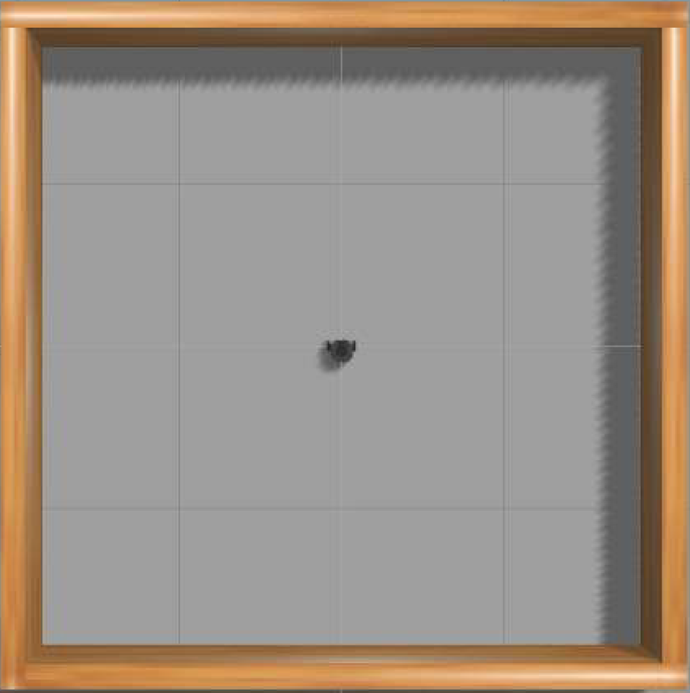
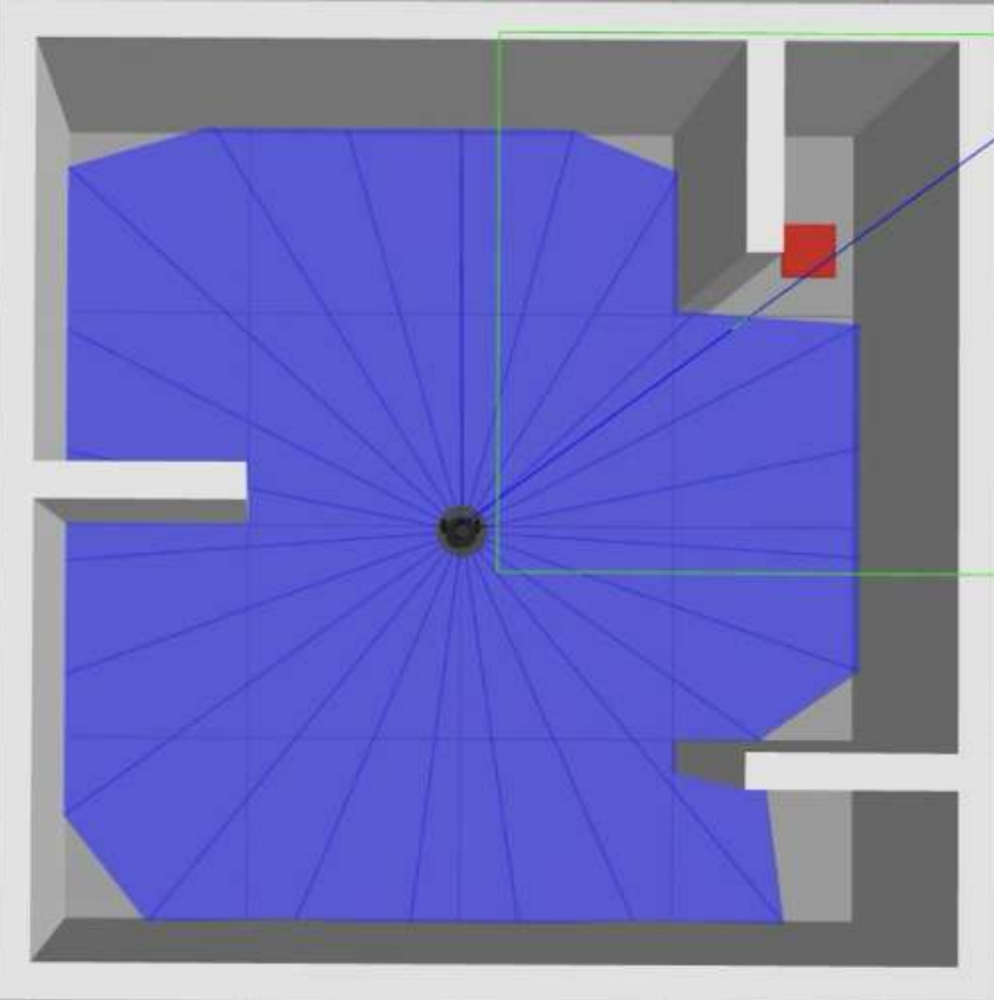
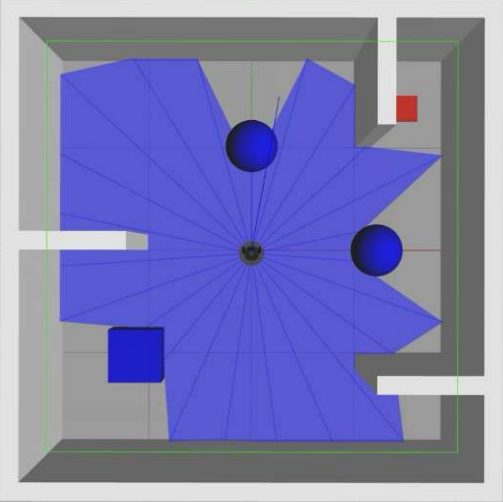

# TurtleBot3 Machine Learning 環境構築手順書
TurtleBot3 の機械学習（強化学習: DQN）環境を **Ubuntu 22.04 + ROS 2 Humble + Gazebo** でセットアップし、学習まで実行できる状態にするための手順書です。

> NOTE:
> - WSL2 の場合、Gazebo のGUI表示に X11/WSLg の設定が必要になることがあります。
> - 本手順は `~/turtlebot3_ws` を作業ディレクトリとして使用します。

---

## 目次
- [1. ROS 2 のインストール準備（Locale / Universe / apt source）](#1-ros-2-のインストール準備locale--universe--apt-source)
- [2. ROS 2 Humble のインストール](#2-ros-2-humble-のインストール)
- [3. ROS 2 / Gazebo 関連パッケージのインストール](#3-ros-2--gazebo-関連パッケージのインストール)
- [4. Python 機械学習ライブラリのインストール](#4-python-機械学習ライブラリのインストール)
- [5. TurtleBot3 関連パッケージ取得 & ビルド](#5-turtlebot3-関連パッケージ取得--ビルド)
- [6. gazebo_ros_pkgs（必要な場合のみ）](#6-gazebo_ros_pkgs必要な場合のみ)
- [7. 環境変数の設定](#7-環境変数の設定)
- [8. TurtleBot3 モデル設定と起動確認](#8-turtlebot3-モデル設定と起動確認)
- [9. DQN ステージ起動（Gazebo）](#9-dqn-ステージ起動gazebo)
- [10. 学習開始（複数ターミナル）](#10-学習開始複数ターミナル)
- [11. 学習状況の可視化（action_graph / result_graph）](#11-学習状況の可視化action_graph--result_graph)
- [12. Lidarの本数設定](#12-Lidarの本数設定)
- [13. 動的物体が動かないとき（libobstacles.so のトラブルシュート）](#13-動的物体が動かないときlibobstaclesso-のトラブルシュート)
- [14. PPOプログラム詳細](#14-ppoプログラム詳細)
- [15. 使用したステージ詳細](#15-使用したステージ詳細)


---

## 1. ROS 2 のインストール準備（Locale / Universe / apt source）

### 1.1 Locale を UTF-8 に設定
```bash
locale # check for UTF-8
sudo apt update && sudo apt install -y locales
sudo locale-gen ja_JP ja_JP.UTF-8
sudo update-locale LC_ALL=ja_JP.UTF-8 LANG=ja_JP.UTF-8
export LANG=ja_JP.UTF-8
locale # verify settings
```

### 1.2 Ubuntu Universe リポジトリ有効化
```bash
sudo apt install -y software-properties-common
sudo add-apt-repository universe
```

### 1.3 ROS 2 の APT ソース追加
```bash
sudo apt update && sudo apt install -y curl

export ROS_APT_SOURCE_VERSION=$(
  curl -s https://api.github.com/repos/ros-infrastructure/ros-apt-source/releases/latest \
  | grep -F "tag_name" | awk -F\" '{print $4}'
)

curl -L -o /tmp/ros2-apt-source.deb \
  "https://github.com/ros-infrastructure/ros-apt-source/releases/download/${ROS_APT_SOURCE_VERSION}/ros2-apt-source_${ROS_APT_SOURCE_VERSION}.$(. /etc/os-release && echo ${UBUNTU_CODENAME:-${VERSION_CODENAME}})_all.deb"

sudo dpkg -i /tmp/ros2-apt-source.deb
```

---

## 2. ROS 2 Humble のインストール
```bash
sudo apt update
sudo apt upgrade -y

sudo apt install -y ros-humble-desktop
sudo apt install -y ros-humble-ros-base
sudo apt install -y ros-dev-tools
```

---

## 3. ROS 2 / Gazebo 関連パッケージのインストール
```bash
sudo apt install -y ros-humble-gazebo-*
```

---

## 4. Python 機械学習ライブラリのインストール

> NOTE: ここは環境によって依存が崩れやすいので、必要なら venv/conda などで分離推奨。

```bash
sudo apt install -y python3-pip
pip3 install tensorflow==2.11.0
pip3 install keras==2.11.0
pip3 install setuptools==58.2.0
pip3 install numpy==1.23.5
```

---

## 5. TurtleBot3 関連パッケージ取得 & ビルド

### 5.1 ワークスペース作成
```bash
source /opt/ros/humble/setup.bash
mkdir -p ~/turtlebot3_ws/src
cd ~/turtlebot3_ws/src
```

### 5.2 パッケージ取得
```bash
git clone -b humble https://github.com/ROBOTIS-GIT/DynamixelSDK.git
git clone -b humble https://github.com/ROBOTIS-GIT/turtlebot3_msgs.git
git clone -b humble https://github.com/ROBOTIS-GIT/turtlebot3.git
git clone -b humble https://github.com/ROBOTIS-GIT/turtlebot3_simulations.git
git clone -b humble-devel https://github.com/ROBOTIS-GIT/turtlebot3_machine_learning.git
```

### 5.3 ビルド
```bash
sudo apt install -y python3-colcon-common-extensions

cd ~/turtlebot3_ws
colcon build --symlink-install

echo 'source ~/turtlebot3_ws/install/setup.bash' >> ~/.bashrc
source ~/.bashrc
```

---

## 6. gazebo_ros_pkgs（必要な場合のみ）

> 公式環境で動作する場合は不要なこともあります。必要になった場合のみ実施してください。

```bash
cd ~/turtlebot3_ws/src
git clone -b ros2 https://github.com/ros-simulation/gazebo_ros_pkgs.git

cd ~/turtlebot3_ws
colcon build --packages-select gazebo_ros_pkgs
source ~/.bashrc
```

---

## 7. 環境変数の設定

> `ROS_DOMAIN_ID` は変更しても良い（ネットワーク環境や他ノードと干渉する場合に調整）。

```bash
echo 'export ROS_DOMAIN_ID=30 #TURTLEBOT3' >> ~/.bashrc
echo 'source /usr/share/gazebo/setup.sh' >> ~/.bashrc
echo 'source /opt/ros/humble/setup.bash' >> ~/.bashrc

source ~/.bashrc
```

---

## 8. TurtleBot3 モデル設定と起動確認

強化学習を行う前に、使用する TurtleBot3 のモデルを設定し、Gazebo で起動できるか確認します。

```bash
export TURTLEBOT3_MODEL=burger
echo 'export TURTLEBOT3_MODEL=burger' >> ~/.bashrc
source ~/.bashrc

ros2 launch turtlebot3_gazebo empty_world.launch.py
```

---

## 9. DQN ステージ起動（Gazebo）

DQN 用のステージを起動します。

```bash
ros2 launch turtlebot3_gazebo turtlebot3_dqn_stage1.launch.py
```

> 💡 Stage番号を変えてもワールドが変わらない場合  
> - 指定している `.world` ファイルが正しいか  
> - `turtlebot3_gazebo` が「どのワークスペースのもの」を読んでいるか（`source` の順番）  
> を確認してください。

---

## 10. 学習開始（複数ターミナル）

DQN 学習は複数ノードを立ち上げて実行します。  
以下は **Stage1** の例です（Stage番号は必要に応じて変更）。

### Terminal 1：Gazebo（ステージ起動）
```bash
ros2 launch turtlebot3_gazebo turtlebot3_dqn_stage1.launch.py
```

### Terminal 2：Gazebo 環境ノード
```bash
ros2 run turtlebot3_dqn dqn_gazebo 1
```

### Terminal 3：DQN 環境ノード
```bash
ros2 run turtlebot3_dqn dqn_environment
```

### Terminal 4：DQN エージェントノード
（環境によってコマンドが異なる場合があります。リポジトリ内の `turtlebot3_dqn` の README / launch を参照してください。）

---

## 11. 学習状況の可視化（action_graph / result_graph）

### Terminal 5：行動と報酬の確認（アクション / 即時報酬 / 合計報酬）
```bash
ros2 run turtlebot3_dqn action_graph
```

### Terminal 6：学習曲線（Q値最大の平均 + 合計報酬）
各エピソードの進行に伴う **Q 値の最大値の平均** と **合計報酬（Total Reward）** を、エピソード番号に対して線形プロットします。

```bash
ros2 run turtlebot3_dqn result_graph
```

---
## 12. Lidarの本数設定

- 対象ファイル  
  `/turtlebot3_simulations/turtlebot3_gazebo/models/turtlebot3_burger/model.sdf`

必要に応じて **LiDAR のサンプル数を変更（360 → 48）**する。

---

### 概要

状態は環境の観測値であり，ロボットの現在の状況を表す。  
本システムでは，状態ベクトルの次元数は **26 次元**で構成されており，

- LiDAR（LDS）値：24 次元  
- ゴールまでの距離：1 次元  
- ゴールまでの角度：1 次元  

を含む。

LiDAR 値は **前方 180 度の範囲**を使用するため，  
360 度全体では **48 本の LiDAR サンプル**が必要となる。

TurtleBot3 の LDS（LiDAR Distance Sensor）のデフォルト設定は  
**360 本**となっているため，以下のファイルを編集して調整する。

## 13. 動的物体が動かないとき（libobstacles.so のトラブルシュート）

### 初期状態の症状
`ros2 launch turtlebot3_gazebo turtlebot3_dqn_stage3.launch.py` を実行しても、ステージ内の **動的オブジェクト（障害物など）が動かない**。

原因として、以下のプラグインが読み込まれていない可能性があります：

```xml
<plugin name="obstacles" filename="libobstacles.so"/>
```

### 依存関係（生成物）の確認
```bash
find ~/turtlebot3_ws -name libobstacles.so
```

#### 結果例
```
/home/icsl/turtlebot3_ws/build/turtlebot3_gazebo/libobstacles.so
```

- `build/` にはあるが `install/` には無い  
  → **CMake 側に install 指令が無い（または不足）** 可能性が高い。

### まずはビルド生成物を直接参照して動作検証（暫定対応）
```bash
export GAZEBO_PLUGIN_PATH="$TB3_WS/build/turtlebot3_gazebo:$GAZEBO_PLUGIN_PATH"
```

この状態で `ros2 launch ...` を実行し、動的物体が動くか確認します。

---

### 動いた場合：CMake に install ルールを追加（恒久対応）

次のファイルを編集：
- `~/turtlebot3_ws/src/turtlebot3_simulations/turtlebot3_gazebo/CMakeLists.txt`

**install 欄**に以下を追記：

```cmake
install(TARGETS
  obstacles
  obstacle1
  obstacle2
  traffic_light_plugin
  traffic_bar_plugin
  ARCHIVE DESTINATION lib
  LIBRARY DESTINATION lib
  RUNTIME DESTINATION bin
)
```

#### 念のためのチェックリスト（CMake）
すでに書かれているはず：

- `find_package(gazebo REQUIRED)`
- `include_directories(${GAZEBO_INCLUDE_DIRS})`
- `link_directories(${GAZEBO_LIBRARY_DIRS})`
- `target_link_libraries(obstacles ${GAZEBO_LIBRARIES})`

### package.xml も確認（依存の明示）
同じディレクトリの `package.xml` に以下を追加：

```xml
<build_depend>gazebo_dev</build_depend>
<exec_depend>gazebo</exec_depend>
```

### 反映（再ビルド & セットアップ）
```bash
cd ~/turtlebot3_ws
colcon build --symlink-install --packages-select turtlebot3_gazebo --allow-overriding turtlebot3_gazebo
source install/setup.bash
```

インストール先に入ったか確認：
```bash
find install/turtlebot3_gazebo -maxdepth 5 -name 'libobstacles.so' -print
```

最後に起動：
```bash
ros2 launch turtlebot3_gazebo turtlebot3_dqn_stage3.launch.py
```

うまく行かなかった場合は、環境変数の反映漏れ等の可能性もあるので **一度再起動** してから再度試すのも有効です。


---
## 14. PPOプログラム詳細

## Reward Function

総報酬は以下の 3 要素の和として定義される．

1. **Distance Reward**  
   ゴールに接近した場合のみ正の報酬を与える．後退時の負報酬は局所解を誘発しやすいため，0 にクリッピングする．

2. **Obstacle Penalty**  
   上記の障害物回避ペナルティを加算する．

3. **Terminal Reward**  
   - 成功時：最大 `+600`（早く到達するほど高い）  
   - 失敗時：`-500`

```python
def calculate_reward(self):

    distance_to_goal = math.sqrt(
        (self.goal_pose_x - self.robot_pose_x) ** 2 +
        (self.goal_pose_y - self.robot_pose_y) ** 2
    )

    if not hasattr(self, 'prev_distance'):
        self.prev_distance = distance_to_goal

    distance_diff = self.prev_distance - distance_to_goal
    distance_reward = max(0.0, distance_diff) * 100.0

    obstacle_reward = self.compute_weighted_obstacle_reward()

    terminal_reward = 0.0
    steps = max(1, getattr(self, "_ep_steps", self.local_step))
    S = float(self.max_step)

    if self.succeed:
        scale = max(0.2, 1.0 - (steps - 1) / S)
        terminal_reward = 600.0 * scale
    elif self.fail:
        terminal_reward = -500.0

    self.prev_distance = distance_to_goal
    return distance_reward + obstacle_reward + terminal_reward
```

---

## PPO Network Architecture

連続値制御を行うため，Actor は行動分布の平均 μ と標準偏差 σ を出力する．  
μ は `tanh` 関数により `(-1, 1)` に正規化され，σ は対数空間で学習し指数変換後にクリッピングすることで学習の安定性を確保する．  
Critic は状態価値関数 \( V(s) \) を推定する．

```python
class Actor(nn.Module):
    def __init__(self, state_dim=28, action_dim=2):
        super().__init__()
        self.net = nn.Sequential(
            nn.Linear(state_dim, 256), nn.ReLU(),
            nn.Linear(256, 128), nn.ReLU(),
        )
        self.mu_layer = nn.Linear(128, action_dim)
        self.log_std = nn.Parameter(torch.zeros(action_dim))

    def forward(self, x):
        x = self.net(x)
        mu = torch.tanh(self.mu_layer(x))
        std = torch.exp(self.log_std).clamp(1e-3, 1.0)
        return mu, std


class Critic(nn.Module):
    def __init__(self, state_dim=28):
        super().__init__()
        self.net = nn.Sequential(
            nn.Linear(state_dim, 256), nn.ReLU(),
            nn.Linear(256, 128), nn.ReLU(),
            nn.Linear(128, 1)
        )

    def forward(self, x):
        return self.net(x).squeeze(-1)
```

---

## GAE (Generalized Advantage Estimation)

アドバンテージ推定には GAE を採用する．  
TD 誤差を基に，割引率 γ と係数 λ を用いて時間逆順にアドバンテージを計算することで，分散を抑えつつ長期的な報酬構造を反映した学習を実現する．

```python
def compute_gae(rewards, values, is_last_step_terminal, gamma=0.99, lam=0.95):

    T = len(rewards)
    advantages = np.zeros(T, dtype=np.float32)
    last_gae = 0.0

    for t in reversed(range(T)):
        is_terminal = (t == T - 1) and is_last_step_terminal
        next_value = 0.0 if is_terminal else values[t + 1]

        delta = rewards[t] + gamma * next_value - values[t]
        last_gae = delta + gamma * lam * last_gae
        advantages[t] = last_gae

    returns = advantages + np.asarray(values[:-1], dtype=np.float32)
    return returns.tolist(), advantages.tolist()
```

---

## PPO Update Rule

PPO の損失関数は以下の 3 要素から構成される．  
クリッピングにより急激な方策更新を抑制し，エントロピー正則化により探索性を維持する．

- **Clipped Actor Loss**
- **Critic Mean Squared Error Loss**
- **Entropy Regularization**

```python
def train(self, states, actions, old_logps, returns, advantages):

    mu, std = self.actor(states)
    dist = torch.distributions.Normal(mu, std)

    logp = dist.log_prob(actions).sum(dim=-1)
    ratio = torch.exp(logp - old_logps)

    surr1 = ratio * advantages
    surr2 = torch.clamp(ratio, 1 - self.clip_range, 1 + self.clip_range) * advantages

    actor_loss = -torch.mean(torch.min(surr1, surr2))
    actor_loss -= self.ent_coef * dist.entropy().mean()

    values = self.critic(states)
    critic_loss = 0.5 * torch.mean((returns - values) ** 2)

    self.opt_actor.zero_grad()
    actor_loss.backward()
    nn.utils.clip_grad_norm_(self.actor.parameters(), 0.5)
    self.opt_actor.step()

    self.opt_critic.zero_grad()
    critic_loss.backward()
    nn.utils.clip_grad_norm_(self.critic.parameters(), 0.5)
    self.opt_critic.step()

    return actor_loss.item(), critic_loss.item()
```

## 15. 使用したステージ詳細
<p align="center">
  
  
  
</p>

<p align="center">
  <b>Stage 1</b>：障害物なし（壁のみ）　
  <b>Stage 2</b>：狭路環境　
  <b>Stage 3</b>：静的障害物回避
</p>

## 15. 備考

- 本リポジトリは **シミュレーション環境での学習実行**を目的とする  
- 実機適用時には別途 TurtleBot3 実機設定が必要  
- PPO 等の独自強化学習手法を導入する場合は、Python 仮想環境（venv/conda）での管理を推奨する  

---

## 16. 参考資料

- ROBOTIS TurtleBot3 Machine Learning  
  https://emanual.robotis.com/docs/en/platform/turtlebot3/machine_learning/


